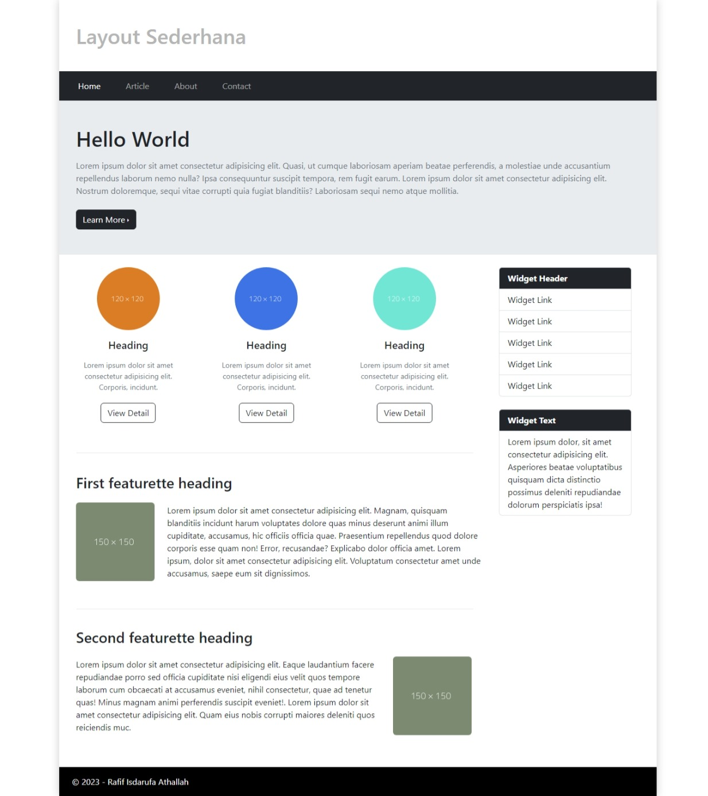

Nama : Rafif Isdarufa Athallah

NIM : 312210299

Kelas : TI.22.A3

---

## Pratikum 6 : Web Framework

### Instruksi Praktikum
1. Persiapkan text editor misalnya VSCode.
2. Buat folder baru dengan nama lab6_css_framework
3. Buat file baru dokumen html
4. Buat struktur dasar dari dokumen HTML.
5. Buatlah layout web sederhana menggunakan css framework (Twitter Bootsrtap).
6. Lakukan validasi dokumen html dengan mengakses http://validator.w3.org

Berdasarkan gambar layout web berikut, buatlah menggunakan Twitter Bootstrap.

---

### Tugas

- Membuat tampilan layout sederhana menggunakan css framework
- Kode [HTML](./html/lab6_css_frameworks.html)

---

### Sekian, terimakasih.